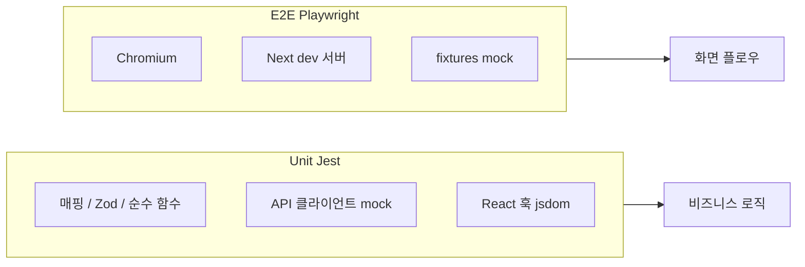

# KKIUM-FE 테스트 구성

이 문서는 **Unit(Jest)** 과 **E2E(Playwright)** 테스트 구성을 정리합니다.  
(Storybook + Vitest는 별도 축이며, 배포/PR 파이프라인과 분리되어 있습니다.)

---

## 한눈에 보기

| 구분 | 러너 | 실행 명령 | CI / 배포 |
|------|------|-----------|-----------|
| **Unit** | Jest (`next/jest`) | `pnpm test:unit` | CodeBuild `buildspec.yml` — **빌드 전** 실행 |
| **E2E** | Playwright | `pnpm test:e2e` | GitHub Actions `.github/workflows/e2e.yml` (PR → `main` / `dev`) |
| (참고) Storybook | Vitest 브라우저 | Storybook 통합 | Chromatic 등 별도 워크플로 |

```text
[배포]  pnpm install → pnpm test:unit → pnpm build → out/ 아티팩트
[PR]    pnpm install → pnpm test:e2e (Playwright + dev 서버)
```

---

## Unit 테스트 (Jest)

### 설정

| 항목 | 값 |
|------|-----|
| 설정 파일 | `jest.config.mjs` |
| 패턴 | `src/**/*.test.ts` (`.test.tsx` 없음) |
| 기본 환경 | `testEnvironment: 'node'` |
| 경로 alias | `@/*` → `src/*` |
| watchman | `false` |

### 규모 (현재)

- **26 test suites / 98 tests**
- **3 suites**는 파일 상단 `@jest-environment jsdom` + `@testing-library/react` `renderHook` 사용  
  → `jest-environment-jsdom` 필요 (`devDependencies`에 포함)

| jsdom 훅 테스트 |
|----------------|
| `useExperienceAddForm.test.ts` |
| `useExperienceAddStep.test.ts` |
| `useExperienceAddMaterials.test.ts` |

### 검증 범위

- 순수 함수, Zod 스키마, API → UI 매핑
- API 클라이언트는 **mock** (`api.patch` / `api.delete` URL·body·사전 검증)
- **제외:** 브라우저 전체 플로우, 실제 HTTP, `copyToClipboard` 등 DOM 오케스트레이션

### 도메인별 파일 목록

#### Apply — API (3)

| 테스트 파일 | 대상 |
|-------------|------|
| `src/app/api/apply/jdAnalysisStatus.test.ts` | 분석 상태 정규화·종료/진행 판별 |
| `src/app/api/apply/types.test.ts` | JD URL·분석·자소서 문항 Zod 스키마 |
| `src/app/api/apply/resumeQuestionApi.test.ts` | 자소서 문항 PATCH/DELETE (mock) |

#### Apply — 페이지 유틸 (10)

| 테스트 파일 | 대상 |
|-------------|------|
| `buildSaveResumeRequest.test.ts` | 저장 요청·question ID·경험 ID 파싱 |
| `limitJobPostingFieldText.test.ts` | 공고 본문·자소서 문항 길이 제한 |
| `mapJdAnalysisToView.test.ts` | JD 분석 → 분석 탭 UI 모델 |
| `mapJdAnalysisExperienceToApplyMatch.test.ts` | 분석 경험 → 매칭 카드 |
| `mapJdExperienceAnalysisToView.test.ts` | 경험 분석 패널 매핑 |
| `mapJdResumeToCoverLetterQuestions.test.ts` | resume → 자소서 문항 목록 |
| `mapJdResumeToJobPostingSnapshot.test.ts` | 공고 스냅샷 |
| `mapExperienceCardToApplyMatch.test.ts` | 경험 카드 → 지원 매칭 |
| `mapResumeQuestionExperience.test.ts` | 문항별 경험 → 커버레터 UI |
| `enrichResumeQuestionExperiences.test.ts` | 경험 type 보강 |

#### Experience (9)

| 테스트 파일 | 대상 |
|-------------|------|
| `experienceAddValidation.test.ts` | 경험 추가 폼 검증 |
| `mapAnalyzeResponseToBasicInfoForm.test.ts` | 분석 응답 → 기본 정보 폼 |
| `mapExperienceAddFormToCreateRequest.test.ts` | 폼 → 생성 API 요청 |
| `mapExperienceResponse.test.ts` | 경험 API 응답 매핑 |
| `mapExperiencePieceType.test.ts` | 경험 piece 타입 매핑 |
| `mapExperienceItemToUpdateRequest.test.ts` | 수정 요청 매핑 |
| `useExperienceAddForm.test.ts` | 추가 폼 훅 (jsdom) |
| `useExperienceAddStep.test.ts` | 단계 훅 (jsdom) |
| `useExperienceAddMaterials.test.ts` | 자료 훅 (jsdom) |

#### Home / 공통 (4)

| 테스트 파일 | 대상 |
|-------------|------|
| `src/app/api/home/types.test.ts` | 홈 대시보드 Zod 스키마 |
| `src/app/_utils/formatRecruitmentPeriod.test.ts` | 채용 기간 포맷 |
| `src/app/_constants/jobTypeCardMappingData.test.ts` | 직무 유형 카드 매핑 |
| `src/app/_utils/calculateNameCompatibility.test.ts` | 이름 궁합 계산·쿼리 |

### 파일 위치 규칙

대상 소스와 **같은 디렉터리**에 `*.test.ts`를 둡니다.

```text
mapJdAnalysisToView.ts  ↔  mapJdAnalysisToView.test.ts
```

### 로컬 실행

```bash
pnpm test:unit
pnpm test:unit:watch
pnpm test:unit -- resumeQuestionApi    # 패턴 필터
```

### AWS CodeBuild (`buildspec.yml`)

| 단계 | 명령 |
|------|------|
| `install` | `pnpm install --frozen-lockfile` |
| `build` | `pnpm test:unit` |
| `build` | `pnpm build` |

유닛 테스트 실패 시 빌드·배포가 중단됩니다.

### Unit 시나리오 상세 (Apply API)

#### `jdAnalysisStatus.test.ts`

| 테스트 | 기대 동작 |
|--------|-----------|
| `normalizeJdAnalysisStatus` | 공백 trim, 대문자 변환. `undefined` → 빈 문자열 |
| `resolveJdAnalysisStatus` | `analysisStatus` 우선, 없으면 `analysis_status` |
| terminal status | `COMPLETED` / `FAILED`만 종료 |
| in progress | `PENDING`, `RUNNING`, 빈 값 등은 진행 중 |

#### `types.test.ts`

| 테스트 | 기대 동작 |
|--------|-----------|
| `assertParseableJdUrlResponse` | 제목·회사·분야·본문 중 하나라도 값 있으면 통과 |
| `updateJdResumeQuestionRequestSchema` | `content` trim, 빈 값 parse 실패 |
| `jdAnalysisResponseSchema` | Pending 시 `jdInfo`·`matchResult` null 허용 |
| `jdAnalysisResponseSchema` | `analysis_status` → `analysisStatus` 정규화 |

#### `resumeQuestionApi.test.ts`

| 함수 | 기대 동작 |
|------|-----------|
| `updateJdResumeQuestion` | `PATCH /api/v1/resume/jd/{jdId}/questions/{questionId}` |
| `updateJdResumeQuestion` | 잘못된 입력 시 Zod 실패, `api.patch` 미호출 |
| `deleteJdResumeQuestion` | `DELETE` 동일 경로, body 없음 |
| `deleteJdResumeQuestion` | 잘못된 ID 시 `api.delete` 미호출 |

### Unit 시나리오 상세 (Apply 유틸 · Home)

Apply 페이지 유틸·Home 공통 함수의 기대 동작은 이전 `docs/test-docs.md`와 동일합니다.  
(매핑·저장 요청·필드 제한·대시보드 스키마·채용 기간·직무 카드·궁합 계산 등)

---

## E2E 테스트 (Playwright)

### 설정

| 항목 | 값 |
|------|-----|
| 설정 파일 | `playwright.config.ts` |
| 테스트 디렉터리 | `e2e/` |
| 브라우저 | Chromium (`Desktop Chrome`) |
| baseURL | `http://localhost:{E2E_PORT}` (기본 **3001**) |
| dev 서버 | `pnpm dev --hostname localhost --port {E2E_PORT}` |
| CI | `retries: 2`, `workers: 1`, `forbidOnly: true` |

E2E용 env (OAuth redirect 등)는 `playwright.config.ts` `webServer.env`에 mock 값이 설정됩니다.

### 시나리오 (5 tests / 4 spec)

| 파일 | 테스트 | 설명 |
|------|--------|------|
| `e2e/login.spec.ts` | 로그인 페이지 OAuth 버튼 노출 | `/login` — 카카오·구글 버튼, 로고 |
| `e2e/login.spec.ts` | 비인증 보호 라우트 | `/experience` → `/login` 리다이렉트 |
| `e2e/apply.spec.ts` | 지원 목록 표시 | 인증 + mock API, `/apply/list` |
| `e2e/experience.spec.ts` | 경험 목록·상세 패널 | 인증 + mock API, 목록·패널 열기/닫기 |
| `e2e/experience-add.spec.ts` | 경험 추가 단계 이동 | 첫 단계 → 기본 정보 단계 |

### 픽스처

| 파일 | 역할 |
|------|------|
| `e2e/fixtures/auth.ts` | `mockAuthenticatedSession` — `sessionStorage`에 `mg_access_token` 주입 |
| `e2e/fixtures/api.ts` | `page.route` API mock (`mockUserProfileApi`, `mockApplyListApi` 등). 미등록 요청 → 404 JSON |

실제 백엔드 없이 **브라우저 + 네트워크 인터셉트**로 UI 플로우를 검증합니다.

### 로컬 실행

```bash
pnpm exec playwright install --with-deps chromium   # 최초 1회
pnpm test:e2e
pnpm test:e2e:ui
pnpm test:e2e:report
```

### GitHub Actions

- 워크플로: `.github/workflows/e2e.yml`
- 트리거: `pull_request` (`main`, `dev`), `workflow_dispatch`
- 실패 시: `playwright-report/`, `test-results/` 아티팩트 (7일 보관)

**배포 파이프라인(buildspec)에는 E2E가 포함되지 않습니다.**

---

## Unit vs E2E

| | Unit | E2E |
|--|------|-----|
| 속도 | 빠름 (~1s대) | 느림 (dev 서버 기동 포함) |
| 범위 | 함수·스키마·단일 훅 | 로그인·목록·패널 등 사용자 경로 |
| API | Jest mock | Playwright `page.route` |
| 인증 | 없음 | `sessionStorage` 토큰 주입 |
| 실패 시 | 배포 차단 | PR 체크 실패 |



---

## Storybook / Vitest (참고)

| 항목 | 설명 |
|------|------|
| 설정 | `vitest.config.ts`, `@storybook/addon-vitest` |
| 목적 | 스토리 기반 컴포넌트·a11y 테스트 (Chromium headless) |
| 실행 | Storybook 개발/CI 워크플로 (`.github/workflows/chromatic.yml` 등) |

`pnpm test:unit` / `pnpm test:e2e`와는 별도입니다.

---

## TypeScript / 빌드

- `tsconfig.json`에서 `e2e/`, `playwright.config.ts`는 Next.js **앱 빌드 타입체크에서 제외**
- E2E는 Playwright가 직접 TypeScript를 처리합니다

---

## 관련 문서

- AWS Jest 연동 요약: `docs/aws-jest-integration.md`
- (레거시) Jest 상세만 모은 문서: `docs/test-docs.md` — Unit Apply/Home 상세 표 포함, suite 수는 **이 문서 기준(26/98)** 을 따릅니다
